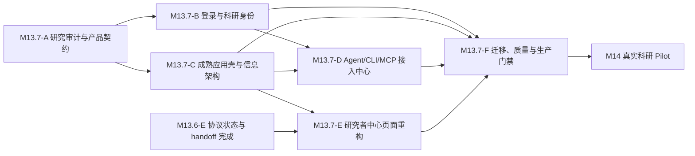

# M13.7 成熟产品壳、科研身份与 Agent 接入闭环

## 1. 为什么需要 M13.7

M13.5 建立了基础视觉语言，M13.6 定义了 Agent-first Web 应该展示的科研状态，但当前生产站仍然只达到“路由和数据容器存在”，没有达到成熟科研产品的最低使用门槛。

2026-08-10 对 `https://evimesh.com`、当前 Web 代码和公开路由的审计得到以下事实：

| 现状 | 用户后果 | M13.7 决策 |
|---|---|---|
| 主导航直接暴露 Projects、Questions、Tasks、Claims、Verification、Events | 用户必须先理解数据库对象才能决定去哪里 | 改为 Home、Explore、Work、Agent、Docs 的任务型导航 |
| GitHub OAuth 代码已存在，但生产导航没有明确登录入口或账户状态 | 能力不可发现，匿名和登录态没有产品边界 | 建立完整登录入口、会话状态和账户菜单 |
| 没有 ORCID 登录和已验证科研身份 | 科研人员无法把平台身份与学术身份可信关联 | 通过 ORCID OAuth/OIDC 收集已验证 iD，禁止手填冒充 |
| `/settings/tokens` 已存在，但不在导航或 Settings 中，且只显示原始 scope | CLI/SDK 用户不知道从哪里获得、管理或撤销凭据 | 建立 Account Settings 与 Agent Connection Center，默认引导设备授权，Token 作为高级路径 |
| 生产 Settings 和 Token 页提示 Supabase public configuration unavailable | 登录、资料和 Token 管理在生产不可用 | 把公开配置校验、部署门禁和健康检查列为 P0 |
| 没有 Agent/MCP/CLI 阅读与接入页 | 用户拿到 Agent 后仍不知道服务地址、权限、对象语义和第一条命令 | 建立可验证的 Connect 流程、客户端配置和 Agent 阅读指南 |
| 首页由多个空数据框组成，缺少真实样例和下一步 | 新用户无法判断平台价值，也不知道该做什么 | 区分匿名 Landing 与登录后 Watchlist Home，并提供真实公开示例和可执行空状态 |
| Project 页面按数据库对象分 Tab | 科研过程被切碎，缺少“问题处于什么阶段”的叙事 | 改为研究工作区：概况、当前前沿、论证、证据、验证与变化 |

因此 M13.7 不是视觉换皮，也不是继续添加孤立页面。它负责补齐一个成熟产品最基础的四个闭环：

1. 人能登录、识别自己并管理可信身份；
2. 人能按科研任务而不是数据库结构找到内容；
3. 人能安全地连接自己的 CLI、MCP 或 Agent；
4. 人能在不了解内部协议实现的前提下理解当前研究状态。

## 2. 与 M13.6 的边界

M13.6 回答“科学状态展示什么”：

- Argument、Evidence、Verification、Frontier 四种协议忠实视角；
- Claim state、revision、关系、Receipt、Finding、Challenge 和 ResearchEvent；
- 关注变化、不可变链接和 Agent handoff；
- 禁止无 Policy 来源的支持率和真理分数。

M13.7 回答“人和 Agent 如何进入并使用这些能力”：

- 全局产品壳、导航和搜索；
- GitHub、ORCID、账户和公开研究者资料；
- Settings、Token、CLI、MCP 与 Agent 接入；
- 匿名首页、登录后首页、Explore、Work 和研究工作区；
- 生产配置、无障碍、响应式和真实用户门禁。

M13.7 不改变 EviMesh 协议对象、稳定 ID、不可变 revision 或签名语义，也不把研究图退化为 Question → Claim → Evidence 单父树。

## 3. Design Read

这是面向科研人员与科研 Agent 的产品级平台重构，不是营销落地页换皮。

- 视觉语言：科研可信度 + GitHub 式开发者工具成熟度；
- `DESIGN_VARIANCE: 5`：有清晰品牌和研究语义，但不牺牲熟悉的产品模式；
- `MOTION_INTENSITY: 3`：只为反馈、层级和上下文切换服务；
- `VISUAL_DENSITY: 6`：比消费产品更密，但必须通过渐进展开避免压迫；
- 一个产品只使用一个设计系统家族，不混用多套组件库；
- 产品界面以 Primer React 和 Primer 导航模式为实现基线，EviMesh 只在语义组件和品牌 Token 上扩展；
- 不复制 GitHub 品牌，不照搬仓库概念，只复用其已验证的应用壳、设置页、导航、菜单、表单和反馈模式。

## 4. 研究者心智模型与全局信息架构

### 4.1 用户首先看到的不是对象表

用户的入口问题是：

- 我关注的研究发生了什么变化？
- 某个问题现在论证到什么阶段？
- 哪些验证、质疑或任务需要我处理？
- 我怎样让自己的 Agent 读取并继续这项工作？

因此一级导航冻结为：

| 一级入口 | 回答的问题 | 主要内容 |
|---|---|---|
| Home | 我关注的研究发生了什么？ | Watchlist 变化、最近访问、Agent 活动、待处理事项 |
| Explore | 平台上有什么值得看？ | Questions、Projects、Topics、People 的统一搜索与筛选 |
| Work | 我现在能做什么？ | 我的 Task、验证队列、质疑、草稿和贡献记录 |
| Agent | 怎样让工具读取和继续工作？ | MCP、CLI、SDK、Token、连接状态和 Agent 阅读指南 |
| Docs | EviMesh 如何工作？ | 人类 Quickstart、协议概念、API/MCP/CLI 参考和安全说明 |

全局 Header 还必须包含：

- EviMesh 品牌入口；
- 全局搜索和命令面板；
- 未登录时的 Sign in 与明确的主 CTA；
- 登录后的头像、账户菜单和未读状态；
- 移动端等价入口。

Projects、Questions、Claims 等对象类型保留为 Explore 的筛选维度、搜索结果类型和上下文内页面，不再平铺为一级导航。

### 4.2 上下文导航

全局壳使用稳定 Header；不同区域使用就近的上下文侧栏或 Tab：

- Account Settings：Profile、Connected identities、Tokens、Security、Notifications；
- Agent：Overview、MCP、CLI、SDK、Read with an agent、Security；
- Research workspace：Summary、Current frontier、Argument、Evidence、Verification & challenges、Activity；
- Explore：All、Questions、Projects、Topics、People。

所有页面使用可预测的 PageHeader、breadcrumb、主动作位置和返回路径。用户不能因为进入详情页就失去全局方向。

## 5. 身份与账户模型

### 5.1 登录入口

登录页提供三条明确路径：

1. Continue with ORCID：科研身份优先；
2. Continue with GitHub：开发者和 Agent 使用者优先；
3. Email：无第三方账户的回退路径。

每个入口都说明用途和将请求的权限。第三方登录失败、回调错误、账号冲突和邮箱缺失必须有可恢复流程。

### 5.2 ORCID 不是普通个人链接

ORCID iD 必须通过 OAuth/OIDC 获取并标记为已验证：

- 不允许用户手工录入一个 iD 后获得“已验证”状态；
- 使用官方 ORCID iD 图标和显示规范；
- 解释连接 ORCID 的收益和数据用途；
- 支持已有本地账户安全关联 ORCID；
- 处理 ORCID 未返回可用邮箱的补充与验证流程；
- 关联、解除关联和账号碰撞必须重新认证并写入安全审计。

Supabase 当前没有可直接假定可用的原生 ORCID provider。M13.7-A 必须先完成技术 Spike，在“托管 Supabase 可配置的自定义 OAuth/OIDC”与“EviMesh 自有 OAuth 回调和 external identity 表”之间形成 ADR，之后才能实现。

### 5.3 研究者资料

资料分为私有账户设置与公开研究者页面。公开资料最少包含：

- display name、avatar、bio；
- affiliation 与 research fields；
- 已验证 ORCID iD；
- 已关联 GitHub；
- 个人网站和允许公开的链接；
- 可追溯的公开贡献、验证和参与项目；
- 每个字段的可见性控制。

OAuth 身份、公开链接和权限凭据必须分表建模，不能混在一个自由文本 profile JSON 中。

## 6. Agent、MCP 与 CLI 接入体验

### 6.1 Connection Center

`/agent` 是从“听说 EviMesh”到“Agent 完成第一次可信读取”的完整路径，而不是文档链接集合。

首屏按步骤显示：

1. 选择客户端：Codex、Claude、Cursor、CLI 或 Generic MCP；
2. 登录并授权最小权限；
3. 复制或自动生成配置；
4. 测试连接；
5. 读取一个真实公开 Question；
6. 查看来源、revision 和继续研究的 handoff。

每一步都显示当前状态、失败原因、重新尝试和撤销入口。

### 6.2 认证策略

- CLI 和支持的 MCP 客户端优先使用浏览器/设备授权，避免让新用户手工复制长期 Token；
- Personal access token 作为自动化、SDK 和不支持交互授权客户端的高级路径；
- Token 创建时必须填写名称，默认要求过期时间，选择人类可读的最小 scope，可选限制 Project；
- 列表显示创建时间、过期时间、最后使用、scope、资源限制和状态；
- 明文只展示一次，支持立即撤销；
- Token 不进入 URL、日志、handoff、Analytics 或浏览器持久存储；
- 公开文档不使用真实凭据，复制示例默认使用环境变量占位符。

### 6.3 Agent 阅读与使用页

`/agent/read` 必须让一个没有参与开发的 Agent 或用户理解：

- EviMesh 的 Project、Question、ResearchContract、Task、Attempt、Claim revision、Evidence、VerificationReceipt、Finding、Challenge、FrontierSnapshot 和 ResearchEvent；
- Argument、Evidence、Verification、Frontier 四个视角之间的区别；
- 稳定 ID、revision、snapshot、Policy 和不可变来源为何重要；
- 哪些 MCP resource/tool 是只读发现，哪些会产生写入；
- 如何检查权限、最新版本、来源和签名；
- 如何从 Web handoff 恢复同一上下文；
- 如何在不上传私密数据的情况下请求 Agent 帮助。

工具和资源目录必须从 MCP/OpenAPI schema 生成或校验，避免文档与实现漂移。

## 7. 关键页面契约

### 7.1 匿名 Landing

匿名首页只做四件事：

1. 用一句话说明 EviMesh 是可追溯的开放分布式科研网络；
2. 用一个真实公开研究示例展示 Question、当前前沿、证据、验证和变化；
3. 提供 Explore research 与 Connect your agent 两条清晰路径；
4. 说明 ORCID、GitHub、不可变 revision 和公开分享如何建立信任。

禁止用四个空列表代替产品叙事。没有生产数据时使用经过标识的演示数据或精选公开对象，不伪装成实时内容。

### 7.2 登录后 Home

Home 按重要性而不是发布时间排序：

- Changed since your last visit；
- 关注对象的 critical / attention / update 变化；
- My work 与验证阻塞；
- 最近访问和保存的研究；
- Agent connection/activity 状态。

变化等级只表达注意优先级，不表达研究结论真伪。

### 7.3 Explore

Explore 提供一个搜索入口，允许按 Question、Project、Topic、People、状态、更新时间和可参与性筛选。结果卡首先回答研究问题、阶段、最近变化和参与入口，内部 ID 放在技术详情中。

### 7.4 Research workspace

Project 和 Question 页面不再使用数据库对象列表作为叙事主轴。首屏必须回答：

- 研究范围和 Contract 是什么；
- 当前 Frontier 是什么；
- 主要争议和验证阻塞在哪里；
- 最近发生了什么变化；
- 用户下一步可以阅读、关注、分享或 handoff 什么。

详细对象通过 M13.6 的 Argument、Evidence、Verification、Frontier 视角渐进展开。

## 8. 交付 DAG

每个 Part 只创建一个 PR。Part 内按依赖允许并行实现和独立验证，不为每个原子任务单独开 PR。

### M13.7-A：研究审计与产品契约

冻结生产审计、竞品模式、研究者任务模型、全局 IA、Primer 采用 ADR、ORCID 技术 ADR、可点击原型和概念测试。退出前不得大规模重写页面。

### M13.7-B：登录与科研身份

修复生产 Auth 配置，完成 GitHub、ORCID、Email 登录，身份关联，研究者资料，公开个人页和账户菜单。

### M13.7-C：成熟应用壳与信息架构

落地 Primer 适配层、全局 Header、任务型导航、上下文侧栏、搜索、命令面板、移动端导航和统一页面状态。

### M13.7-D：Agent、CLI 与 MCP 接入中心

完成连接向导、设备授权、Personal access token 管理、客户端配置、Agent 阅读指南、工具目录和第一次调用验证。

### M13.7-E：研究者中心页面重构

完成匿名 Landing、Watchlist Home、Explore、Work、研究工作区、公开贡献者身份和跨页面 handoff。

### M13.7-F：迁移、质量与生产门禁

移除旧壳、验证配置、无障碍、响应式、性能、认证安全、视觉回归和真实用户任务，形成生产证据包。

## 9. 明确非目标

- 不在 M13.7 开发平台自有通用聊天 Agent；
- 不用点赞、排行榜或内容推荐算法制造“活跃感”；
- 不把 Evidence 数量转换为支持率、真理分数或质量评分；
- 不允许 ORCID 手填后显示为已验证；
- 不把长期 Token 作为新用户首选登录方式；
- 不把所有底层对象重新放回一级导航；
- 不同时引入 Primer、Material、Ant Design 等多套组件系统；
- 不为了视觉效果隐藏 revision、Policy、来源和权限状态；
- 不在 M13.7 改写研究协议或破坏已有永久链接。

## 10. M14 准入门槛

M13.7-F 完成后，必须有生产证据证明：

1. 匿名新用户能在 45 秒内说明 EviMesh 的用途和可信来源机制；
2. 用户能在 2 分钟内完成 GitHub 或 ORCID 登录，并在账户菜单找到身份和安全设置；
3. ORCID 只通过认证流程显示为已验证，账号关联冲突有安全恢复路径；
4. 用户能在 3 分钟内找到 Agent 入口并让 CLI 或 MCP 完成第一次只读调用；
5. 用户能创建、查看最后使用时间并撤销最小权限 Token，明文只展示一次；
6. 用户能在 60 秒内解释一个 Question 的当前阶段、主要争议、验证阻塞和 Frontier；
7. 一级导航不要求用户理解数据库表，旧 URL 有兼容重定向或稳定保留；
8. 390px、768px、1440px 和系统深色模式无阻断布局问题；
9. WCAG 2.2 AA 自动检查无阻断项，键盘和屏幕阅读器能完成登录、导航、阅读、连接和撤销；
10. 生产环境缺少 Supabase、API 或 MCP 公共配置时部署失败，而不是向用户显示运行时错误；
11. Core Web Vitals 达到 Good 目标，关键页面无明显布局跳动；
12. 至少 5 名目标用户完成任务测试，关键任务成功率不低于 80%，无 Severity 1 或 Severity 2 未解决问题。

## 11. 设计与安全依据

- Primer Navigation：<https://primer.style/product/ui-patterns/navigation/>
- Primer NavList：<https://primer.style/product/components/nav-list/>
- ORCID OAuth sign-in guidelines：<https://info.orcid.org/documentation/integration-guide/orcid-oauth-sign-in-guidelines/>
- ORCID sign-in using ORCID credentials：<https://info.orcid.org/documentation/integration-guide/sign-in-using-orcid-credentials/>
- ORCID iD display guidelines：<https://info.orcid.org/documentation/integration-guide/orcid-id-display-guidelines/>
- ORCID minimum integration requirements：<https://info.orcid.org/documentation/integration-guide/minimum-requirements-for-member-integrations/>
- Supabase GitHub social login：<https://supabase.com/docs/guides/auth/social-login/auth-github>
- Supabase identity linking：<https://supabase.com/docs/guides/auth/auth-identity-linking>
- Model Context Protocol remote server connection：<https://modelcontextprotocol.io/docs/develop/connect-remote-servers>
- GitHub personal access token management：<https://docs.github.com/en/authentication/keeping-your-account-and-data-secure/managing-your-personal-access-tokens>
- GitHub API credential security：<https://docs.github.com/en/rest/authentication/keeping-your-api-credentials-secure>
